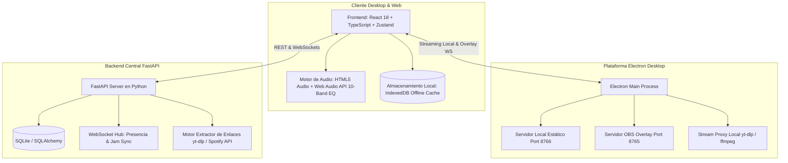

# 🎵 JodiFy 2.0 — Ultimate Music Ecosystem & Streaming Suite

[](https://www.typescriptlang.org/)
[](https://reactjs.org/)
[](https://fastapi.tiangolo.com/)
[](https://www.electronjs.org/)
[](https://vitejs.dev/)
[](https://sqlite.org/)

> **JodiFy** es un ecosistema musical integral de última generación que combina la potencia de un reproductor de escritorio nativo de alto rendimiento (Electron), una aplicación web moderna (React + TypeScript), un servidor backend ultrarrápido (FastAPI), reproducción sin conexión (IndexedDB Offline Engine), resolución automática de enlaces externos (Spotify, YouTube, SoundCloud), integración nativa para streamers (OBS Overlay dinámico) y funciones sociales comunitarias en tiempo real (Jam Sessions colaborativas, mascotas virtuales Pixel-Art y perfiles interactivos animados).

---

## 📑 Tabla de Contenidos
1. [¿Para qué sirve JodiFy?](#-para-qué-sirve-jodify)
2. [Arquitectura del Proyecto](#-arquitectura-del-proyecto)
3. [Módulos y Funcionalidades Principales](#-módulos-y-funcionalidades-principales)
   - [1. Gestor de Descargas y Modo Offline con Progreso Real](#1-gestor-de-descargas-y-modo-offline-con-progreso-real)
   - [2. Sistema Completo de Playlists & Acomodo Personalizado (Drag & Drop)](#2-sistema-completo-de-playlists--acomodo-personalizado-drag--drop)
   - [3. Cola de Reproducción Inteligente (Queue Drag & Drop)](#3-cola-de-reproducción-inteligente-queue-drag--drop)
   - [4. Motor de Audio Profesional & Ecualizador de 10 Bandas](#4-motor-de-audio-profesional--ecualizador-de-10-bandas)
   - [5. Resolución Inteligente de Enlaces Musicales & Detección de Duplicados](#5-resolución-inteligente-de-enlaces-musicales--detección-de-duplicados)
   - [6. Overlay Dinámico para OBS Studio & Streaming](#6-overlay-dinámico-para-obs-studio--streaming)
   - [7. Gamificación Social: Niveles, Mascotas Pixel-Art y Perfiles Animados](#7-gamificación-social-niveles-mascotas-pixel-art-y-perfiles-animados)
   - [8. Jam Sessions Comunitarias en Tiempo Real](#8-jam-sessions-comunitarias-en-tiempo-real)
4. [Estructura del Repositorio](#-estructura-del-repositorio)
5. [Flujo de Datos y Funcionamiento Interno](#-flujo-de-datos-y-funcionamiento-interno)
6. [Guía de Puesta en Marcha & Instalación](#-guía-de-puesta-en-marcha--instalación)

---

## 🎯 ¿Para qué sirve JodiFy?

JodiFy nace como una respuesta a las limitaciones de las plataformas de streaming tradicionales, unificando la música que amas en una sola experiencia fluida, estética y libre de restricciones:
* **Escuchar tu música donde sea, con o sin internet:** Descarga canciones individuales o colecciones completas a tu almacenamiento local mediante almacenamiento binario en IndexedDB, calculando el tamaño exacto y permitiendo una reproducción local offline instantánea.
* **Importar desde cualquier lugar:** Pega enlaces directos de Spotify, YouTube o YouTube Music. JodiFy analiza las pistas o playlists, detecta duplicados para mantener tu biblioteca impecable, extrae la mejor calidad de audio disponible y la pone a disposición de todos los usuarios.
* **Organización personalizada:** Crea tus propias listas de reproducción con colores vibrantes y organiza el orden de tus canciones simplemente arrastrándolas con el ratón.
* **Overlay para creadores de contenido:** Emite en Twitch, YouTube o Kick mostrando en pantalla lo que estás escuchando con un widget transparente y animado en tiempo real sin consumir recursos extra.
* **Música compartida:** Disfruta de sesiones Jam sincronizadas segundo a segundo con tus amigos.

---

## 🏗 Arquitectura del Proyecto

JodiFy está construido siguiendo un modelo desacoplado y reactivo de 3 niveles:



---

## 🚀 Módulos y Funcionalidades Principales

### 1. Gestor de Descargas y Modo Offline con Progreso Real
* **Progreso y Porcentaje Real:** A diferencia de barras de carga simuladas o indeterminadas, JodiFy lee los datos binarios mediante flujos continuos (`ReadableStream`) calculando bytes recibidos versus el `Content-Length` total de la pista de audio.
* **Modal Flotante Multitarea:** Al iniciar la descarga de una o varias canciones, se despliega una ventana modal con carátulas, títulos, barra de progreso con gradiente de neón, velocidad y porcentaje numérico exacto.
* **Notificación Estática / Widget Minimizado:** El modal puede cerrarse o minimizarse en cualquier instante. Si hay descargas en proceso o pendientes en segundo plano, un indicador persistente en la esquina de la pantalla muestra el número de descargas activas y el porcentaje promedio general. Al hacer clic sobre este badge, el modal vuelve a desplegarse inmediatamente para visualizar el detalle.
* **Motor IndexedDB Seguro:** El audio descargado se almacena como `Blob` binario en la base de datos IndexedDB del navegador o app de escritorio, permitiendo reproducir música incluso con el servidor backend apagado o en modo avión.

### 2. Sistema Completo de Playlists & Acomodo Personalizado (Drag & Drop)
* **Pestaña Playlists en la Barra Lateral ("Tu Colección"):**
  - Junto a las opciones `GLOBAL`, `FAVORITAS` y `DESCARGADAS`, se integra la pestaña **`PLAYLISTS`**.
  - Permite crear nuevas playlists con gradientes y nombres personalizados con un solo clic.
  - **Reproducción directa con 1 clic:** Un botón de play dedicado reproduce la playlist entera de inmediato (reproduce el primer tema y encola automáticamente todos los siguientes en orden secuencial).
  - **Vista en Detalle:** Al hacer clic sobre la playlist, la barra lateral cambia a una vista enriquecida con contador de pistas, duración acumulada y lista completa de temas.
* **Acomodo Personalizado con Arrastre (Drag & Drop):**
  - El usuario puede mantener presionado el clic izquierdo en cualquier canción y arrastrarla verticalmente hacia arriba o hacia abajo.
  - Una línea guía brillante (`drop-line`) indica exactamente la posición donde quedará la canción.
  - El nuevo orden se guarda de forma persistente y automática.
* **Modal & Vista Enriquecida en Pantalla Principal:**
  - En la vista principal (`HomeShowcaseView`), hacer clic sobre cualquier tarjeta de playlist abre el **`PlaylistDetailModal`**, con diseño de revista digital, carátula en alta definición, reproducción completa, modo aleatorio (Shuffle) y soporte nativo para reordenar canciones arrastrándolas con el cursor.

### 3. Cola de Reproducción Inteligente (Queue Drag & Drop)
* **Prioridad y Continuidad:** El cajón de cola (`QueueDrawer`) divide la música entre la "Cola Prioritaria" (canciones añadidas deliberadamente por el usuario) y la "Continuación Automática" desde la colección activa.
* **Reordenamiento Dinámico:**
  - Mantén pulsado el clic izquierdo en el asa de arrastre de cualquier canción en cola para subirla o bajarla de posición.
  - Arrastra temas desde la lista siguiente directamente a la cola prioritaria.
  - Botón de un solo clic para "Mover a continuación directa" para que una canción suene exactamente después de la actual.

### 4. Motor de Audio Profesional & Ecualizador de 10 Bandas
* **Web Audio API de Alta Fidelidad:** Nodo de entrada conectado a una cadena de 10 filtros `BiquadFilterNode` que cubren el espectro de frecuencias auditivas: 32Hz, 64Hz, 125Hz, 250Hz, 500Hz, 1kHz, 2kHz, 4kHz, 8kHz y 16kHz.
* **Persistencia de Perfiles en Caliente:** Las ganancias personalizadas del usuario se guardan en el perfil local y se aplican en tiempo real al motor de sonido sin necesidad de reiniciar la pista o volver a activar el ajuste.
* **Presets de Fábrica:** Incluye curvas acústicas calibradas para *Bass Boost, Agudos Cristalinos, Vocales Claros, Rock, Electrónica, Pop, Acústico y Plano*.

### 5. Resolución Inteligente de Enlaces Musicales & Detección de Duplicados
* **Compatibilidad Universal:** Soporta URLs de Spotify (tracks, álbumes y playlists completas), YouTube y YouTube Music.
* **Importación Masiva Asistida:** Al pegar el enlace de una playlist externa, JodiFy analiza todos sus temas, presenta una lista detallada con casillas de verificación para seleccionar qué canciones importar y avisa con alertas visuales si detecta temas duplicados para evitar repeticiones.
* **Fallback y Streaming Local:** Si el streaming directo falla o requiere autorización de plataforma, el proxy interno de JodiFy Desktop resuelve el flujo de audio mediante `yt-dlp` localmente en milisegundos.

### 6. Overlay Dinámico para OBS Studio & Streaming
* **Diseñado para Creadores:** Servidor HTTP local integrado en el puerto `8765` sirviendo la página `http://127.0.0.1:8765/obs-overlay.html`.
* **Transmisión WebSocket en Tiempo Real:** Emite el estado de reproducción, título, artista, tiempo transcurrido, carátula y barras de ecualizador con fondo transparente (Alpha Channel) para integrarse como fuente de navegador en OBS Studio, Streamlabs o vMix.

### 7. Gamificación Social: Niveles, Mascotas Pixel-Art y Perfiles Animados
* **Nivel por Tiempo de Escucha:** Cada minuto de música escuchada otorga experiencia que desbloquea recompensas e insignias.
* **Mascotas Virtuales Pixel-Art:** Compañero interactivo en la pantalla (Gato con variantes de colores, Perro fiel, Magikarp animado, etc.) que reacciona con animaciones a la música y al volumen.
* **Animaciones de Perfil:** Efectos visuales de banner (estilo Nitro / JodiFy Prestige) que cobran vida cuando otros miembros de la comunidad visitan tu perfil o en la sala de Jam.

### 8. Jam Sessions Comunitarias en Tiempo Real
* **Escucha Compartida:** Únete o crea salas de reproducción sincronizada donde el Host controla la cola y los miembros pueden sugerir canciones, enviar reacciones en directo y charlar.

---

## 📁 Estructura del Repositorio

```text
JodiFy/
├── JodiFyDesktop/               # Aplicación de escritorio nativa (Electron)
│   ├── electron/               # Procesos Main y Preload de Electron
│   │   ├── main.ts             # Servidor HTTP local, OBS WebSocket server, stream proxy
│   │   └── preload.ts          # API segura ipcRenderer expuesta al frontend
│   ├── dist-electron/          # Código transpilado de Electron
│   ├── package.json            # Scripts de empaquetado y dependencias nativas
│   └── electron-builder.yml    # Configuración de instalador portable e instalable
│
├── JodiFyPage/frontend/        # Interfaz de Usuario y Lógica React
│   ├── src/
│   │   ├── components/         # Componentes modulares
│   │   │   ├── layout/         # PlaylistPanel, PlaylistDetailModal, Topbar, Modales
│   │   │   ├── offline/        # DownloadsModal, DownloadsBadge (Progreso real)
│   │   │   ├── player/         # PlayerControls, QueueDrawer, SongRow
│   │   │   ├── home/           # HomeShowcaseView, vistas de canciones y playlists
│   │   │   ├── social/         # PetCompanionWidget, JamDrawer, ProfileModal
│   │   │   └── ui/             # Botones, Drawer, Avatar, SongCover, Segmented
│   │   ├── store/              # Estado global reactivo con Zustand
│   │   │   ├── downloads.store.ts # Gestor de estado de descargas activas
│   │   │   ├── playlists.store.ts # Colecciones y reordenamiento Drag & Drop
│   │   │   ├── queue.store.ts     # Cola prioritaria y movimiento de posición
│   │   │   ├── player.store.ts    # Control de audio, progreso, volumen y loop
│   │   │   └── library.store.ts   # Catálogo de canciones, filtros y favoritos
│   │   ├── services/           # offline.service.ts, player.service.ts, etc.
│   │   ├── styles/             # CSS modular: components.css, player.css, social.css
│   │   └── lib/                # IndexedDB wrapper (idb.ts), types.ts, utils.ts
│   ├── vite.config.ts          # Configuración de bundling para Web y Electron
│   └── package.json
│
└── jodify-backend/             # Servidor Central de Datos (FastAPI)
    ├── app/
    │   ├── routers/            # Endpoints: /api/songs, /api/links, /api/auth
    │   ├── services/           # link_resolver.py, audio_streamer.py
    │   └── models/             # Modelos de base de datos SQLAlchemy
    ├── run.py                  # Entrypoint uvicorn
    └── requirements.txt        # Dependencias de Python
```

---

## 🔄 Flujo de Datos y Funcionamiento Interno

### Flujo de Descarga con Progreso Real
```text
1. Usuario pulsa "Descargar" en una canción o "Descargar Todo"
                │
2. offline.service.ts llama a useDownloadsStore.enqueueDownload()
                │
3. Se despliega DownloadsModal mostrando la pista en estado "downloading"
   (Si el usuario cierra la ventana, se activa el DownloadsBadge flotante)
                │
4. fetchAudioWithProgress realiza la petición HTTP con res.body.getReader()
   y lee chunk por chunk calculando (bytesReceived / totalBytes) * 100
                │
5. Cada chunk emite updateProgress() actualizando la barra y el porcentaje numérico
                │
6. Al completarse, el audio ensamblado se guarda en IndexedDB con ID único
                │
7. Se marca como "completed" y la canción queda disponible en la pestaña "Descargadas"
```

### Flujo de Reordenamiento por Arrastre (Drag & Drop)
```text
1. Usuario presiona clic izquierdo sobre el asa o fila de la canción
                │
2. onDragStart guarda el índice de origen (e.dataTransfer.setData)
                │
3. onDragOver actualiza el índice objetivo mostrando la drop-line brillante
                │
4. onDrop lee el índice destino y ejecuta reorderPlaylistSongs(playlistId, from, to)
                │
5. Zustand actualiza el arreglo in-memory y sincroniza automáticamente con localStorage
```

---

## 🛠 Guía de Puesta en Marcha & Instalación

### Requisitos Previos
* **Node.js:** v18.0 o superior
* **Python:** 3.10 o superior con `pip` y `yt-dlp`
* **Git**

### 1. Iniciar el Backend (FastAPI)
```bash
cd jodify-backend
python -m venv venv
# En Windows:
.\venv\Scripts\activate
# En Linux/Mac:
source venv/bin/activate

pip install -r requirements.txt
python run.py
```
*El backend quedará escuchando en `http://127.0.0.1:8000`*.

### 2. Iniciar el Frontend en Desarrollo
```bash
cd JodiFyPage/frontend
npm install
npm run dev
```
*La aplicación web estará disponible en `http://localhost:5173`*.

### 3. Ejecutar la Aplicación de Escritorio (Desktop Electron)
```bash
cd JodiFyDesktop
npm install
npm run dev
```

### 4. Compilar para Producción (Instalador / Portable Windows)
```bash
# Paso A: Compilar el frontend optimizado para Electron
cd JodiFyPage/frontend
npm run build:electron

# Paso B: Sincronizar y generar ejecutable
cd ../../JodiFyDesktop
node scripts/sync-dist.mjs
npm run dist:win
```
El instalador o ejecutable portable se generará en la carpeta `JodiFyDesktop/release`.

---

## 🛡 Licencia y Créditos
Desarrollado con pasión para los amantes de la música, el streaming y el buen código.
* **Autores:** Equipo de Desarrollo de JodiFy
* **Versión:** 2.0.0 (Prestige Edition)
